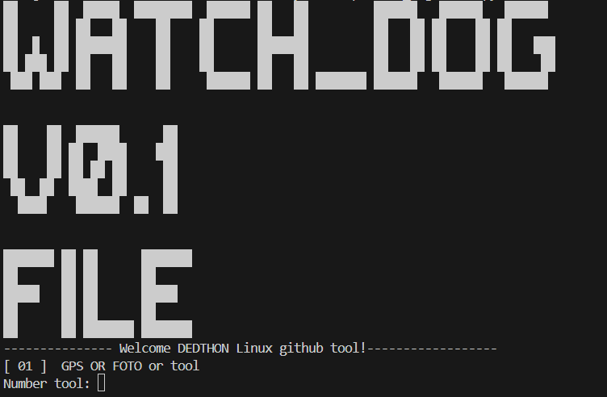

# Watch_dog-v0.1-file - linux screen



# Watch_dog v0.1 update (14/02/2026)

- Camphish 

# install python
for Watch_dog system python run install python

```
sudo apt install python3
```

for command system "Kali linux or Ubuntu or Temux"

## Installing Watch_dog v0.1 linux (kali linux/Ubuntu/Temux)

```
git clone https://github.com/Anthonyili230409/Watch_dog-v0.1-file-linux.git
cd Watch_dog-v0.1-file-linux
python3 DEDTHON-WATCH_DOG-FILE.py
```

you now "Watch_dog v0.1" done commands got
